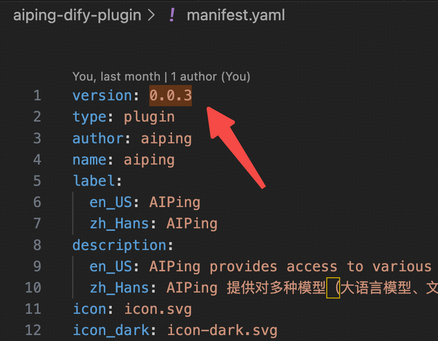

# Dify 插件打包指南

本指南将详细介绍如何为 Dify 平台打包 AI 插件。

## 环境准备

### 安装 Dify Plugin CLI

访问 [Dify Plugin CLI](https://github.com/langgenius/dify-plugin-daemon/releases) 项目地址，下载并安装对应操作系统的最新版本工具。

### Linux 环境示例

以下以 64 位 Linux 系统为例：

1. 下载 `dify-plugin-linux-amd64` 文件
2. 赋予执行权限：
```bash
chmod +x dify-plugin-linux-amd64
```

3. 验证安装：
```bash
./dify-plugin-linux-amd64 version
```

4. 重命名工具（方便使用）：
```bash
mv dify-plugin-linux-amd64 dify
```

## 插件打包方式

本项目支持三种不同的打包方式，根据需要选择合适的方案：

### 1.更新版本号
更新插件前，需要先更新插件的版本号。



### 2. 插件包
#### 2.1. 完整插件包

包含所有功能（模型 + 工具）的完整版本，适用于需要完整功能的场景。

```bash
./dify plugin package ./aiping-dify-plugin/
mv ./aiping-dify-plugin.difypkg aiping-dify-plugin-full.difypkg
```

#### 2.2. 仅包含模型的插件包

只包含 AI 模型功能，适用于只需要模型能力的轻量级场景。

**配置说明：**

在 `./aiping-dify-plugin/manifest.yaml` 中的 `plugins` 字段中只保留 `models` 部分：


```bash
./dify plugin package ./aiping-dify-plugin/
mv ./aiping-dify-plugin.difypkg aiping-dify-plugin-ai.difypkg
```

#### 2.3. 仅包含工具的插件包

只包含工具功能，适用于只需要工具能力的场景。

**配置说明：**

在 `./aiping-dify-plugin/manifest.yaml` 中的 `plugins` 字段中只保留 `tools` 部分，以及需要将 name 改成 aiping_tools：


```bash
./dify plugin package ./aiping-dify-plugin/
mv ./aiping-dify-plugin.difypkg aiping-dify-plugin-tools.difypkg
```

## 注意事项

- 每次打包前请确保插件代码已更新至最新版本
- 生成的 `.difypkg` 文件即为可分发的插件包
- 根据实际需求选择合适的打包方式
- 建议在打包前测试插件功能是否正常